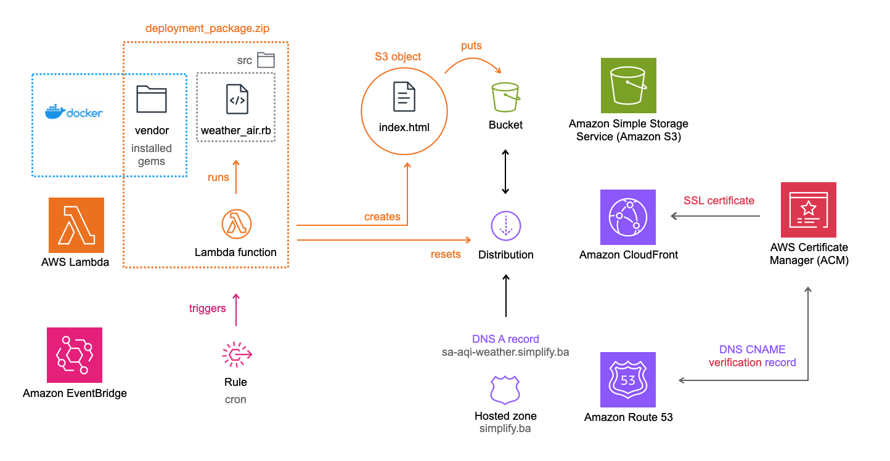

# Deployment documentation

## Table of Contents

- [Introduction](#introduction)
- [Diagram](#diagram)
- [Prerequisites](#prerequisites)
- [Deployment Steps](#deployment-steps)
    - [Create a public hosted zone](#create-a-public-hosted-zone) [Route 53]
    - [Create a bucket](#create-a-bucket) [S3]
    - [Create a SSL certificate](#create-a-ssl-certificate) [ACM]
    - [Create a distribution](#create-a-distribution) [Cloudfront]
    - [Create A record](#create-a-record) [Route 53]
    - [Create Lambda function](#create-lambda-function) [AWS Lambda]
    - [Set Up Scheduled Execution](#set-up-scheduled-execution) [EventBridge]
- [Testing](#testing)
- [Conclusion](#conclusion)

---


## Introduction
This documentation provides a guide for deploying static website using AWS services, featuring serverless computing with **AWS Lambda** and **EventBridge** for event-driven functionality. **S3** is used for data storage, **CloudFront** for global content delivery acceleration, and **Route 53** for DNS management. Secure communication is guaranteed through **ACM** with SSL certificate.

<sub>[back on top ^](#table-of-contents)</sub>

---

## Diagram

<sub>[back on top ^](#table-of-contents)</sub>

---

## Prerequisites:
Before proceeding, ensure you have the following:

- Basic understanding of previously mentioned AWS services.
- Registered domain name.
- AWS account. If not, you can create one at [https://aws.amazon.com/](https://aws.amazon.com/).
- Use IAM (Identity and Access Managment) to create **access key** and store its values in environment variables `AWS_ACCESS_KEY_ID` and `AWS_SECRET_ACCESS_KEY` that can be found in `.env` file.

<sub>[back on top ^](#table-of-contents)</sub>

---

## Deployment Steps:

### Create a public hosted zone
- **Route 53** > [Creating a public hosted zone](https://docs.aws.amazon.com/Route53/latest/DeveloperGuide/CreatingHostedZone.html)

    - If you've purchased your domain from a registrar other than AWS, you need to update the NS records there by replacing the existing name servers with the ones you copied from Route 53.

<sub>[back on top ^](#table-of-contents)</sub>

---

### Create a bucket
- **S3 (Simple Storage Service)** > [Creating a bucket](https://docs.aws.amazon.com/AmazonS3/latest/userguide/create-bucket-overview.html)
  
    - Ensure you've enabled `Static website hosting`.
    - Set permissions for website access by adding [bucket policy](https://docs.aws.amazon.com/AmazonS3/latest/userguide/WebsiteAccessPermissionsReqd.html#bucket-policy-static-site). 
    - Make sure you add `bucket name` in `.env` file to the `BUCKET` environment variable.

<sub>[back on top ^](#table-of-contents)</sub>

---

### Create a SSL certificate
- **ACM (AWS Certificate Manager)** > [Requesting a public certificate](https://docs.aws.amazon.com/acm/latest/userguide/gs-acm-request-public.html)

<sub>[back on top ^](#table-of-contents)</sub>

---

### Create a distribution
- **CloudFront** > [Create a CloudFront distribution](https://docs.aws.amazon.com/AmazonS3/latest/userguide/website-hosting-cloudfront-walkthrough.html#create-distribution)

    - Make sure you add `distribution_id` in `.env` file to the `CLOUDFRONT_DISTRIBUTION` environment variable.

<sub>[back on top ^](#table-of-contents)</sub>

---

### Create A record
- **Route 53** > [Update the alias record to point to a CloudFront distribution](https://docs.aws.amazon.com/AmazonS3/latest/userguide/website-hosting-cloudfront-walkthrough.html#update-record-sets) 

<sub>[back on top ^](#table-of-contents)</sub>

---

### Create Lambda function
- **AWS Lambda** > [Building Lambda functions with Ruby](https://docs.aws.amazon.com/lambda/latest/dg/lambda-ruby.html)

    - Follow the instructions for [creating .zip deployment packages with native libraries](https://docs.aws.amazon.com/lambda/latest/dg/ruby-package.html#ruby-package-native) since `nokogiri` gem contains native extensions written in C and it's used in this project. You will need [Docker](https://www.docker.com/) for this.
    - `Dockerfile` and `lambda_function` are already created.
    - When creating the `.zip deployment package` use `zip -rFS` instead of `zip -r` command to ensure zip deletes unnecessary files.

        ```
        zip -rFS deployment_package.zip lambda_function.rb src vendor
        ```

    - After exiting the container, delete `vendor` folder and restore `bundle` locally:
        ```
        rm -rf .bundle vendor
        ```
    -  In Lambda console, under the `Configuration` tab:
        - select `General configuration` and set `Timeout` to 10 sec (or more).
        - select `Environment variables` and add key/value pairs `API_KEY`, `BUCKET` and `CLOUDFRONT_DISTRIBUTION` that you can find in `.env` file.
        - select `Permissions`, follow `Role name` link to IAM console. Under `Permissions policies` panel, choose `Add permissions` and `Attach policy`. Search for `AmazonS3FullAccess` and `CloudFrontFullAccess` and add them.

<sub>[back on top ^](#table-of-contents)</sub>

---  

### Set Up Scheduled Execution 
- **EventBridge** > [Creating an Amazon EventBridge rule that runs on a schedule](https://docs.aws.amazon.com/eventbridge/latest/userguide/eb-create-rule-schedule.html)

    - Open the `Functions` page of the Lambda console and choose your function.
    - Under `Function overview`, choose `Add trigger`.
    - Set the trigger type to `EventBridge (CloudWatch Events)`.
    - For `Rule`, choose `Create a new rule.` This project is using `cron(17 * ? * * *)`, which means it triggers Lambda every day at 17 minutes past the hour (regardless of the hour, day of the month, month, day of the week, or year). 

<sub>[back on top ^](#table-of-contents)</sub>

---

## Testing
- Manually trigger the Lambda function through the AWS Lambda Console to ensure it runs successfully.
- Access the static website using the CloudFront distribution URL.

<sub>[back on top ^](#table-of-contents)</sub>

---

## Conclusion
Congratulations! You've successfully deployed a static website using AWS Lambda, CloudFront, ACM, Route 53 and S3. Make adjustments as needed for optimal performance.  For further details, refer to the [official AWS documentation](https://docs.aws.amazon.com/).

<sub>[back on top ^](#table-of-contents)</sub>

---