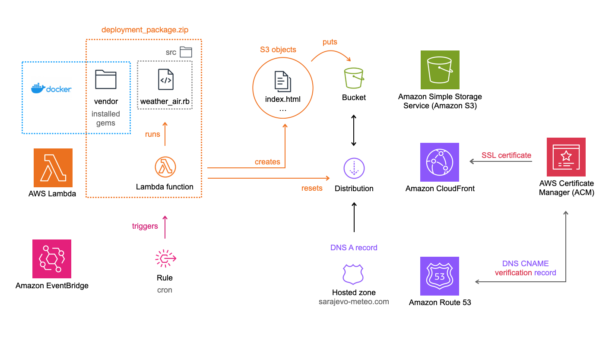

# Sarajevo weather & air pollution
> Simple, static website providing information about air quality index (AQI) and weather conditions in Sarajevo. https://sarajevo-meteo.com/

### Overview

Ruby script retrieves data from 3rd-party APIs or resorts to web scraping when APIs are not available. It generates HTML files by integrating the collected data into an ERB (Embedded Ruby) template. To ensure that information is up-to-date, the script is scheduled to run automatically every hour using AWS Lambda.

### Features
- Meteoalarms (There is also a [gem](https://github.com/em-jov/meteoalarm) created to implement this feature)
- Weather information
    - Current weather 
    - Next 24 hours forecast
    - 5-day forecast in 3-hour intervals
    - UV index and sun protection recommendations
    - 24 hours forecast for local mountains 
- Air Quality information
    - Hourly AQI data from multiple monitoring sites
    - Map of monitoring sites locations 
    - Health recommendations
    - AQI data from additional sources for cross-verification
- Internationalization (I18n) Support
    - Available in Bosnian and English languages

### Prerequisites

- Ensure that you have the following installed on your machine:
    - Ruby: Download and install Ruby 3.2.
    - Bundler: Install Bundler by running `gem install bundler`
- API key from [OpenWeather](https://openweathermap.org/api)
- [Sentry](https://sentry.io) account for error monitoring   

### Setup
1. Clone the Repository:
    ```
    git clone https://github.com/em-jov/sa_weather_aqi.git
    cd sa_weather_aqi
    ```
2. Install Dependencies:
    ```
    bundle install
    ```
3. Configure:
    - Create a new file named `.env` and paste the content from the `.env.example` file into it
    - Update the `API_KEY` variable with the obtained `OpenWeather API key`
    - During the deployment process, you will acquire the values for the remaining environment variables

### Deployment


The details of this process are outlined in a separate [file](DEPLOYMENT.md).

### Contributing
Your contributions are welcome and appreciated. If you find issues or have improvements, feel free to open an issue or submit a pull request.

### License
[MIT License](MIT-LICENCE.txt)